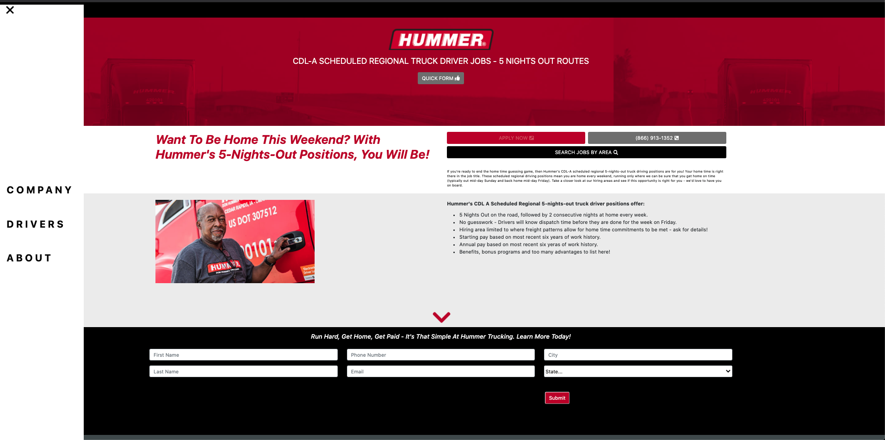

# CIA Mock-Up

## Description
This is a landing page mock-up for Conversion Interactive Agency. I chose to use React to build this page because it keeps the file structure neat and offers dom rerendering. It offers easy integration with npm packages, Bootstrap, animations, etc., making the build much quicker.

Deployed version:  
https://salty-ravine-13691.herokuapp.com/

## Usage

## Built With
React  
Node  
Bootstrap    
HTML  
CSS  
JavaScript  
Font-Awesome
React-Spring

## Author
 Eric LaFontsee   
 Email: elafontsee@gmail.com
  
## License
  MIT

## Acknowledgements
Maks Akymenko - "react-burger-menu" animation was used in my Navbar component.
    - https://github.com/maximakymenko/react-burger-menu-article-app
